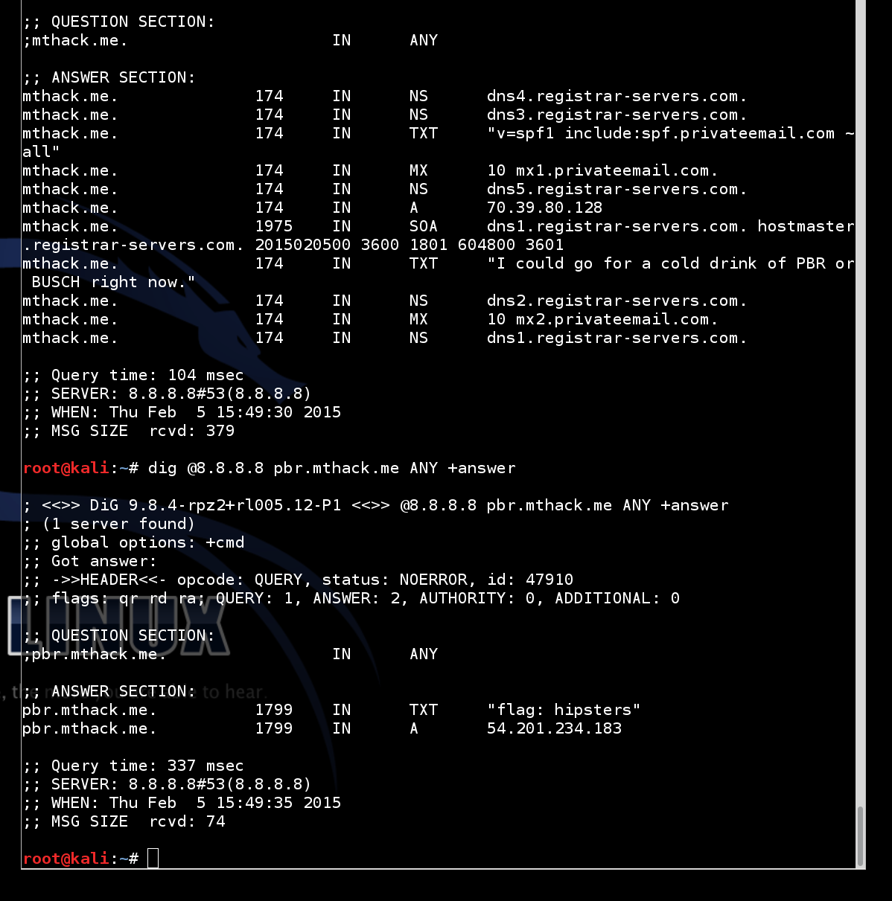
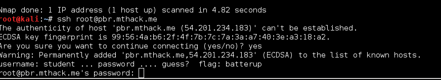
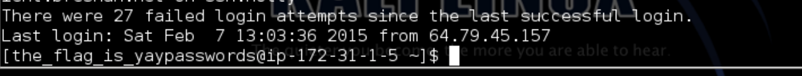
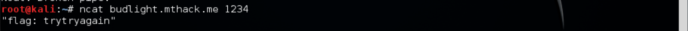
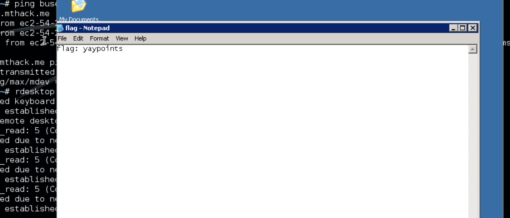
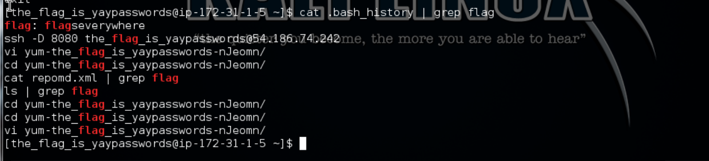
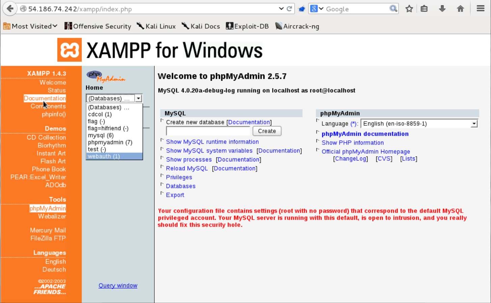
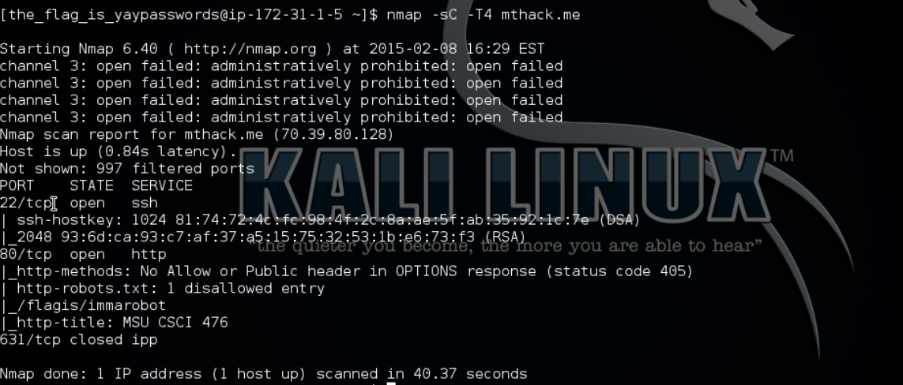
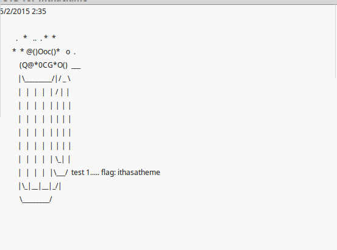
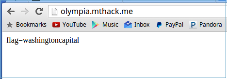

# Hacking mthack.me
### Practicum 1

### Flag 1
  
I found my first flag, hipsters. When the test was assigned I figured I would start with doing a dig of mthack.me. That showed the message hinting to PBR and BUSCH. So I did a dig for pbr.mthack.me and found the first flag.  

### Flag 2
  
Since there was an SSH port open on pbr.mthack.me, decided I would try to log into it. When trying to login as root it popped up with the message "username: student ... password: ... guess? flag: batterup". That was my second flag.  

### Flag 3
  
After being told about the SSH account on pbr.mthack.me, I decided to try to brute force it. I tried the burnett_1024 word list as it is the wordlist that worked for the homework earlier. When that failed I tried the fasttrack.txt wordlist and the password was found within seconds. Once logged in I was presented with my third flag yaypasswords.  

### Flag 4
  
Once in the account, I started snooping around and decided to cat the .ssh/known_hosts file on pbr. In it was budlight.mthack.me, I nmapped it to see what ports were open. I saw that port 1234 was open, and with all ports I find open that I don't understand I decided to ncat it and after disconnecting and reconnecting to the port it presented me with my fourth flag.  

### Flag 5
  
Also while searching around on pbr.mthack.me I found a notes.txt file (in the opt directory) that contained some information about how to log into the busch.mthack.me remote desktop connection. When I nmapped that subdomain there was the rdesktop port open. So I decided to sign in, and on the desktop there was a file named "flag". Opened it and was presented with my fifth flag.  

### Flag 6
  
After those first five flags there was a lull in progress, and I was sort of stuck in where to go next. When I had first logged into pbr.mthack.me I had noticed there was a file of .bash_history so I decided to grep it for flag to see if anyone else had found anything. When I did I found at the top that there was a flag, giving me my sixth. I was very skeptical that this one was real, because I was able to edit the file and write in my own flag if I chose to, so I thought another student may have just been trying to be funny.  

### Flag 7
  
At this point in the test I had finally figured out how to setup Foxy Proxy using ssh -D with the IP address that was in connect.sh. I tried forever trying to use the terminal to nmap and dig the new IP, but soon realized that the proxy only worked for traffic that went through my browser. Because I could see that port 80 was open on the IP from an nmap within pbr.mthack.me I visited that IP address and found my seventh flag in the phpMyAdmin dropdown.

### Flag 8
  
Here is where the progress really slowed. I tried to focus on reaching some of the ports on that IP that I got my seventh flag on, but nothing was coming to. After a while, I remembered that we had learned about Burp and intercepting internet requests, although I couldn't get Burp working. I found that if I ran an nmap with the -sC option it showed some interesting info. Thus leading me to my eighth flag by nmap -sC on mthack.me.

### Flag 9
  
Again progress lulled, and I decided it was time that I tried to get into the secret IRC channel on mthack.me that had been referenced numberous times on the main IRC channel. Using the hints of port 6697, SSL, and that it was on mthack.me. I booted up Linux Mint on my laptop and decided to try to connect to it using Pidgen. After ticking a few boxes, I was able to connect and when I right clicked the channel it showed the option to show the "MOTD". Clicked that, and boom, my ninth flag appeared.

### Flag 10
  
My friend had told me a few days ago that he had found coors.mthack.me, just by trying subdomains with different beers. As someone who doesn't drink alcohol, coming up with beer names was difficult so I googled the top cheap beers and tried them all as subdomains. Luckily I found olympia.mthack.me which presented me with a beautiful flag on its homepage, thus completing the practicum with 10 flags and full credit.

### Summary
I had 3 flags by Thursday night, 5 by Friday night, 7 on Saturday night, and then on Sunday night I had the 10 needed for full credit. I don't think this test took too much time, I didn't view things as being difficult, I viewed myself as not trying hard enough. I probably spent 10-15 hours, but they were all fun and worth while as the act of being stuck forced me to try new ways to try to break into things. Most of the reasons it took me a long time, was because I assumed things would be harder than they were. I expected to have to create a remote shell through msfconsole, etc. I really enjoy the way you teach the class as I feel that many kids now expect so many things to be spoonfed. I think that being forced to "figure things out" is probably one of the best ways to teach people these sorts of things. Also, I never thought that not drinking alcohol would hinder me in school, but I still figured it out :P 